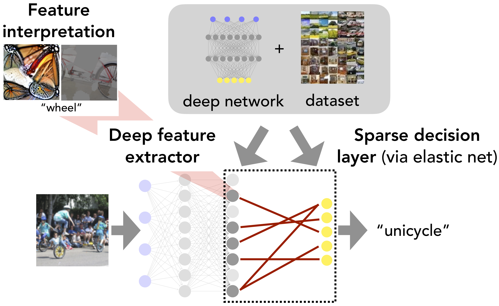

# Improving Deep Network Debuggability via Sparse Decision Layers

This repository contains the code for our paper:

**Leveraging Sparse Linear Layers for Debuggable Deep Networks** <br>
*Eric Wong\*, Shibani Santurkar\*, Aleksander Madry* <br>
Paper: http://arxiv.org/abs/2105.04857 <br>
Blog posts:  [Part1](https://gradientscience.org/glm_saga) and [Part2](https://gradientscience.org/debugging) <br>

<p align="center">

</p>


```bibtex
@misc{wong2021leveraging,
      title={Leveraging Sparse Linear Layers for Debuggable Deep Networks}, 
      author={Eric Wong and Shibani Santurkar and Aleksander Mądry},
      year={2021},
      eprint={2105.04857},
      archivePrefix={arXiv},
      primaryClass={cs.LG}
}
```

## Getting started
*Our code relies on the [MadryLab](http://madry-lab.ml/) public [`robustness`](https://github.com/MadryLab/robustness) library, as well as the [`glm_saga`](https://github.com/MadryLab/glm_saga) library which will be automatically installed when you follow the instructions below. The [`glm_saga`](https://github.com/MadryLab/glm_saga) library contains a standalone implementation of our sparse GLM solver.*
1.  Clone our repo: `git clone https://github.com/microsoft/DebuggableDeepNetworks.git`

2.  Setup the [lucent](https://github.com/greentfrapp/lucent) submodule using: `git submodule update --init --recursive`

3.  We recommend using conda for dependencies:
    ```
    conda env create -f environment.yml
    conda activate debuggable
    ```

## Training sparse decision layers

Contents: 
+ `main.py` fits a sparse decision layer on top of the deep features of the specified pre-trained (language/vision) deep network
+ `helpers/` has some helper functions for loading datasets, models, and features
+ `language/` has some additional code for handling language models and datasets

To run the settings in our paper, you can use the following commands: 
```
# Sentiment classification
python main.py --dataset sst --dataset-path <SST_PATH>  --dataset-type language --model-path barissayil/bert-sentiment-analysis-sst --arch bert --out-path ./tmp/sst/ --cache

# Toxic comment classification (biased)
python main.py --dataset jigsaw-toxic --dataset-path <JIGSAW_PATH>  --dataset-type language --model-path unitary/toxic-bert --arch bert --out-path ./tmp/jigsaw-toxic/ --cache --balance

# Toxic comment classification (unbiased)
python main.py --dataset jigsaw-alt-toxic --dataset-path <JIGSAW_PATH>  --dataset-type language --model-path unitary/unbiased-toxic-roberta --arch roberta --out-path ./tmp/unbiased-jigsaw-toxic/ --cache --balance

# Places-10 
python main.py --dataset places-10 --dataset-path <PLACES_PATH> --dataset-type vision --model-path <MODEL_PATH> --arch resnet50 --out-path ./tmp/places/ --cache

# ImageNet
python main.py --dataset imagenet --dataset-path <IMAGENET_PATH> --dataset-type vision --model-path <MODEL_PATH> --arch resnet50 --out-path ./tmp/imagenet/ --cache
```

## Interpreting deep features
After fitting a sparse GLM with one of the above commands, we provide some
notebooks for inspecting and visualizing the resulting features. See
`inspect_vision_models.ipynb` and `inspect_language_models.ipynb` for the vision and language settings respectively. 

# Maintainers

* [Eric Wong](https://twitter.com/RICEric22)
* [Shibani Santurkar](https://twitter.com/ShibaniSan)
* [Aleksander Madry](https://twitter.com/aleks_madry) 
